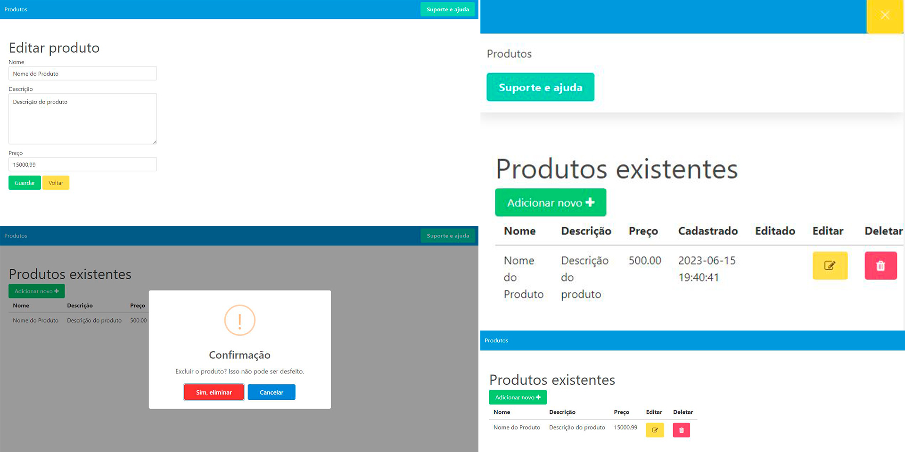

# CRUD com PHP, MySQL, JavaScript e AJAX

## Sobre o projecto

CRUD usando base de dados MySQL com uma aplicação web desenvolvida em JavaScript e PHP, utilizando a técnica AJAX e a codificação JSON.

Utilizei o PHP para reutilizar um modelo com cabeçalho e rodapé, além de conectá-lo ao banco de dados MySQL e responder às solicitações do JavaScript.

Agora, com JavaScript, fiz todo o processamento do lado do cliente. Enquanto o PHP é responsável por renderizar as visualizações e lidar com as solicitações.

Também usei o SweetAlert para os alertas, o fetch para realizar chamadas AJAX e o Bulma para os estilos.
